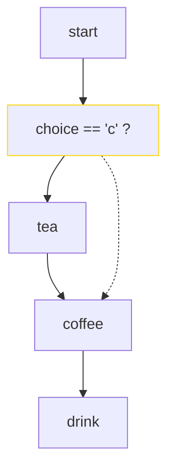
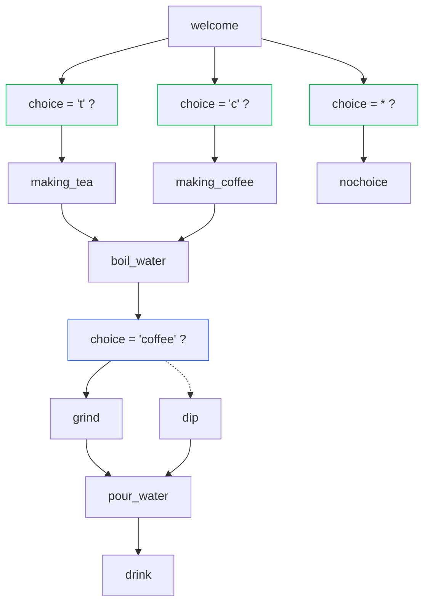

# OrchWiPy

Create data orchestration pipelines over AWS Lambda functions from within python code using decorators.

- No need for separate definition file, you define the orchestration + lambda functions in the code
- Simpler data passing: only return changes to current state rather than the whole state
- Visualize flow graph
- Statically check state passing between steps
- Generate AWS cloudformation template automatically
- Run locally
- Handle lambda invocation payload size limit transparently

We developed _OrchWiPy_ at [ask-next.com](https://ask-next.com)

# Example

```python
from orchwipy import MicroFunctions, ConditionalReturns, ReturnUpdates
from orchwipy import build_cfn_template

# Our pipeline starts at function 'start'
pipe = MicroFunctions(beginner="start")

@pipe.fn()
# pipe.fn() will convert this to a lambda function when deployed
def start(*, choice: str | None, **kwargs):
    # **kwargs is always needed

    beans = None
    if not choice:
        choice = input("Tea or coffee? (t/c)")
    if choice == 'c':
        beans = int(input("How much beans "))

    # if choice is 'c', then we go to 'coffee' else 'tea'
    return ConditionalReturns(
                choice,
                # default choice is 'tea'
                # "*" => passing no other arguments, required for first step
                ReturnUpdates("tea", "*"),
                # only include beans argument
                c=ReturnUpdates("coffee", "*", beans=beans))

@pipe.fn(template_props=dict(Layers=[{"Ref": 'MorePythonPackagesLayer'}]))
# MorePythonPackagesLayer will become a CFN template parameter
def tea(**kwargs):
    print("Have tea")
    # can also return a dictionary, with $next as the next function name
    return {"$next": "coffee", "beans": 5}

@pipe.fn()
def coffee(*, beans: int, **kwargs):
    print(f"Put {beans} beans into the coffee machine")
    # include all the arguments passed previously and add (update) the milk argument
    return ReturnUpdates("drink", milk=True)

@pipe.fn(terminates=True)
# terminates => specify that this may be the end of the pipe
def drink(*, milk: bool | None, **kwargs):
    if milk:
        print("Add some milk if its bitter")
    print("Drink!")
    return {}

# boilerplate: pass execution to pipe when running in AWS lambda
def lambda_handler(event, context):
    pipe.lambda_handler(event, context)

if __name__ == "__main__":
    pipe.check_graph("start")

    # local run
    pipe.run(choice=None)

    # check execution pipeline and generate a graphviz graph for visualization
    with open("example.dot", "w") as f:
        pipe.save_dot(f, top_node="start")

    # generate a aws cloudformation template for deployment
    with open("example.template.yml", 'w') as f:
        build_cfn_template(
            output_template=f,
            code_py_relative_to_template=__file__.split("/")[-1],
            plant=pipe,
            layers=[],
            policies=[],
        )

```

## Visualization

It generates a graphviz dot diagram `example.dot`:



## Static checking

This involves checking all the execution paths to ensure that all the required function arguments are passed through all possible invocations.

In the above example, if we replace this line in function `tea`:

```python
    return {"$next": "coffee", "beans": 5}
```

with

```python
    return {"$next": "coffee"}
```

then the `coffee` step will not receive the `beans` argument when execution flows through `start -> tea -> coffee `. Invoking `pipe.check_graph(start_at="start")` will throw us this warning:

```
:0: MissingArgument: {'beans'} : caller history ['start', 'tea'] -> coffee
```

# More Examples

_tests/sample.py_ is another example:




# Why

Building complex backend pipelines AFAIK requires creating pipeline definitions separate from the code itself. In my experience, this creates a lot of technical baggage. Futher, serverless backends (with AWS Lambda) gives us a lot of scalability but its hard to run locally. Also, Step Functions are great but without static checking, its very easy to get missing data errors while in production.

_Orchwipy_ tries to solve all these issues by having your code as the single source of truth about your data pipeline. Deployment templates, static checking, ... everything simply derives from it.

At [ask-next.com](https://ask-next.com) _Orchwipy_ orchestrates our data pipeline with ~50 services
